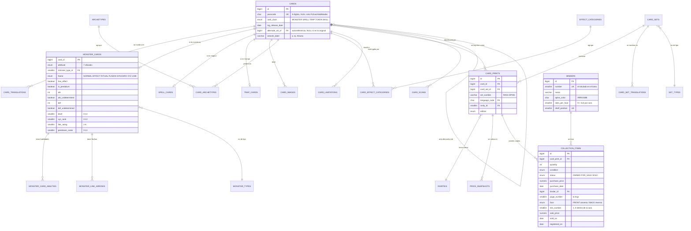

# Modelo de datos

## 1. Fuentes y jerarquía de autoridad

Tres entradas, con pesos distintos a propósito:

| Fuente | Rol | Autoridad |
|---|---|---|
| Base de datos oficial de Konami (db.yugioh-card.com / Neuron) y reglamento oficial | Define qué existe y cómo se clasifica una carta | **Fuente de verdad** |
| `V1.0.0__createalltables.sql` (propuesta previa) | Punto de partida estructural: qué módulos hacen falta | Borrador a corregir |
| `cartas.sql` (4533 filas reales de la colección) | Evidencia de qué casos ocurren de verdad y qué campos se usan | Evidencia, **nunca** autoridad |

La regla: si el dataset contradice a lo oficial, gana lo oficial; el dataset sirve para descubrir casos límite reales (ATK `'?'`, cartas sin passcode, un mismo número de set en tres rarezas) que un diseño "de manual" se dejaría fuera.

## 2. Taxonomía oficial verificada

Contrastado con la base de datos oficial de Konami y el reglamento:

- **Clases de carta:** Monstruo, Mágica, Trampa. *(La colección contiene además 14 Fichas y cartas de Habilidad, que no son ninguna de las tres → el modelo las contempla como clases propias.)*
- **Atributos (7):** DARK, LIGHT, EARTH, WATER, FIRE, WIND, **DIVINE**. El reglamento clásico habla de 6; DIVINE existe y la colección tiene 12 cartas con él.
- **Tipos de monstruo (26):** Aqua, Bestia, Guerrero-Bestia, Dios Creador, Ciberso, Dinosaurio, Bestia Divina, Dragón, Hada, Demonio, Pez, **Ilusión**, Insecto, Máquina, Planta, Psíquico, Piro, Reptil, Roca, Serpiente Marina, Lanzador de Conjuros, Trueno, Guerrero, Bestia Alada, Wyrm, Zombi. Konami añade uno cada 3-4 años (Psíquico 2008, Dios Creador 2011, Wyrm 2014, Ciberso 2017, Ilusión 2022).
- **Marcos de monstruo (7):** Normal, Efecto, Ritual, Fusión, Sincronía, Xyz, Enlace — excluyentes entre sí. **Péndulo se superpone** al marco (existen Fusión/Péndulo y Xyz/Péndulo).
- **Habilidades (6):** Cantante, Volteo, Géminis, Espíritu, Toon, Unión — multivalor, se combinan entre sí y con cualquier marco.
- **Tipos de Mágica (6):** Normal, Continua, Equipo, Juego Rápido, Campo, Ritual. **Tipos de Trampa (3):** Normal, Continua, Contraefecto.
- **Rangos numéricos:** Nivel y Rango 0-13, Escala de Péndulo 0-13, Link Rating 1-6, 8 direcciones de flecha.
- **Número de set:** `PREFIJO-RR###` (p. ej. `RA01-SP001`), donde RR es el código de región: SP, EN, FR, DE, IT, PT, JP, KR, TC, SC.
- **Rarezas:** vocabulario abierto de más de 35 valores y creciendo cada año.

## 3. Qué falla en la propuesta `V1.0.0`

Cada punto viene con la evidencia que lo demuestra, sacada de tus propios datos:

| # | Problema | Evidencia |
|---|---|---|
| 1 | `monster_type` es un **ENUM de un solo valor** con `('NORMAL','EFFECT','FUSION','SYNCHRO','XYZ','PENDULUM','LINK')`. No puede representar "Sincronía + Cantante" ni "Xyz/Péndulo". | 22 filas del dataset ya usan combinaciones: `sincronía/cantante`, `Xyz/péndulo`, `fusion/pendulo`, `ritual/cantante`, `cantante/volteo` |
| 2 | Ese mismo ENUM **no incluye RITUAL**: los Monstruos de Ritual no tienen representación posible. | Oficial: Ritual es uno de los 7 marcos. El dataset tiene 29 cartas de ritual |
| 3 | Faltan las habilidades **Volteo (Flip)** y **Toon**, aunque sí existen `is_tuner/is_gemini/is_spirit/is_union` — e incongruentemente `card_scans` sí tiene `detected_is_flip` y `detected_is_toon` | 35 cartas de volteo y 11 toon en el dataset |
| 4 | `attack INT` / `defense INT`, pero el propio comentario dice "puede ser `?` en la carta". Un `INT` no puede guardar `?`. | 18 ATK y 8 DEF con `'?'`, `'????'`, `'X000'` |
| 5 | **La UNIQUE KEY de `card_set_editions` omite la rareza**: `(card_id, card_set_id, edition, print_language)`. Rechazaría cartas reales tuyas. | **202 números de set** de tu colección existen en más de una rareza (p. ej. `RA01-SP057` en ultra, ultimate y quarter century secret) |
| 6 | `rarity` como ENUM de 15 valores. La lista oficial supera los 35 y crece cada año; ampliarla exige `ALTER TYPE` y desplegar. | Tu dataset ya tiene valores fuera de ese ENUM (`premium gold`, `ultra parallel`, `blue ultra`…) |
| 7 | `race VARCHAR(100)` libre mientras todo lo demás es ENUM: incoherente y sin integridad. | 41 valores distintos, 16 no son Tipos oficiales: erratas (`dargon`, `inescto`, `deinosaurio`) y valores de otra dimensión (`pendulo`, `enlace`, `tierra`, `ishizu`, `pegasus`) |
| 8 | `card_number NOT NULL UNIQUE` (que en realidad es el **passcode**, mal nombrado) impide registrar Fichas y Habilidades, que no llevan passcode. | 32 filas sin `idCarta`, incluidas 14 Fichas/Habilidades |
| 9 | `market_price` como columna mutable en la edición: **sin histórico no hay gráfica de evolución del valor**, que es justo la fase 2 del proyecto. | Objetivo declarado: "evolución del valor en el tiempo" |
| 10 | No existe la **ubicación física** (carpeta/página), que sí llevas registrando. | 4463 filas con carpeta y página informadas |
| 11 | Falta el bloque de **Restricción** (Lista / Avanzada / Tradicional) que aparece en la ficha de la wiki que tomaste como referencia. | Captura de referencia del proyecto |
| 12 | `card_scans` replica ~30 columnas `detected_*` de la ficha de carta: dos esquemas que mantener en paralelo y que se desincronizarán. | Olor de diseño |
| 13 | Módulos de usuarios y tienda dimensionados para una plataforma multiusuario con e-commerce. | Alcance acordado: un solo propietario, sin tienda |
| 14 | El DDL es **MySQL puro** (`ENUM(...)` inline, `ON UPDATE CURRENT_TIMESTAMP`, backticks) y no ejecuta en PostgreSQL. | Decisión de stack ya tomada: PostgreSQL |

Aciertos de la propuesta que se conservan tal cual: la separación carta canónica / traducciones / especialización por clase, las tablas de arquetipos con `is_support`, la jerarquía de categorías de efecto, los comentarios bilingües en cada columna (muy buen detalle para la memoria) y la disciplina de índices.

## 4. Modelo resultante

### Decisiones que merecen su ADR

**Las carpetas son una entidad, no un número (ADR-009).** El diseño de la pantalla de estantería destapó que `binder_number` como entero suelto no daba para nada: hacen falta nombre, color de lomo, orden en la estantería y huecos por página (9 es lo normal, pero existen fundas de 4, 12 y 16). Se añade la tabla `binders` y `collection_items.binder_number` pasa a ser `binder_id` con clave ajena. El número de páginas y el total de cartas **no** se guardan: se derivan en la vista `binder_summary`, para que no puedan quedar desincronizados.

**La ubicación física son cuatro datos, no tres.** Una hoja de carpeta tiene **dos caras** de 9 huecos, así que "página 5, hueco 3" es ambiguo. Se guardan `binder_id`, `page_number` (la hoja), `face` (`FRONT`/`BACK`) y `slot_number` (1..9 dentro de esa cara). Se lee igual que se busca una carta en la estantería: *carpeta 1, página 5, reverso, hueco 3*. `slots_per_face` es el tamaño de una cara, no de la hoja.

La ubicación es **todo o nada** en su parte obligatoria —no hay página sin carpeta—, pero admite estados intermedios: una carta puede estar en una carpeta y una hoja sin cara ni hueco asignados, que es como llegan los datos importados. Lo que no se admite es un hueco sin cara.

**La unicidad de hueco** (una carta por bolsillo físico) está activada: en la colección real no se apilan copias. Es una restricción `UNIQUE` sobre las cuatro columnas, **no un índice parcial**, por dos motivos que se descubrieron probando: como los nulos se consideran distintos entre sí, la restricción normal ya deja pasar todas las filas sin hueco asignado —misma semántica que el índice parcial—, y a diferencia de él **sí se puede diferir**, que es lo único que permite intercambiar dos cartas de sitio sin chocar con la carta que aún está allí. Queda `INITIALLY IMMEDIATE`, y el caso de uso de recolocar difiere la comprobación dentro de su transacción. El mismo patrón se aplica al número y a la posición en la estantería de las carpetas, para poder renumerarlas y reordenarlas.

Esa misma restricción es lo que acota **cuántas cartas caben en una cara**, sin necesidad de contar nada: si cada carta archivada ocupa un hueco y no puede haber dos en el mismo, el máximo queda limitado por construcción, de forma declarativa y atómica. La comprobación fina —que el hueco esté dentro del `slots_per_face` real de esa carpeta— vive en el dominio, que es donde puede explicar el error: *"la página 10 de Magos, reverso, está llena, 9 de 9"*. Se descartó deliberadamente un disparador que contara ejemplares por cara: sería lógica de negocio escondida en la infraestructura, justo lo que la arquitectura hexagonal pretende evitar.

**El buscador tiene tres modos, y cada uno necesita un índice distinto.**

| Modo | Qué hace | Herramienta |
|---|---|---|
| Por nombre | `mago` encuentra "Fantastimago" y "Artistamago" | Trigramas (`pg_trgm`) + GIN |
| Por texto de efecto, literal | Encuentra la secuencia de letras escrita | Trigramas + GIN |
| Por concepto | `invocar cementerio` encuentra cartas con ambas palabras sueltas, en cualquier orden y a cualquier distancia | Texto completo (`tsvector`) + GIN |

Los dos primeros y el tercero **conviven**: el mismo texto indexado dos veces, cada índice para lo suyo. No es duplicidad, son preguntas distintas.

**Los dos modos de subcadena.** El buscador ofrece dos modos excluyentes —por **nombre** o por **texto de efecto**— y en ambos devuelve cualquier coincidencia parcial con lo escrito: `%mago%` encuentra "Mago Oscuro" y "Guerrero del Mago".

Eso descarta la búsqueda de texto completo de PostgreSQL (`tsvector`), aunque fuera uno de los argumentos para elegir PostgreSQL: el texto completo trabaja con **palabras enteras** y no acelera una subcadena arbitraria. La herramienta correcta son los **trigramas** (`pg_trgm`) con índice GIN, más `unaccent` para que "dragon" encuentre "Dragón".

Hay un detalle que hay que conocer: `unaccent()` no es `IMMUTABLE` —depende de un diccionario que se puede cambiar— y PostgreSQL no indexa expresiones no inmutables. Se envuelve en `immutable_unaccent()` fijando el diccionario, que es el patrón estándar. Y la consulta debe escribirse con **la misma expresión** que define el índice, o no lo usa.

Medido sobre 13.000 cartas, el tamaño del catálogo completo: una búsqueda selectiva pasa de **18,9 ms** de recorrido secuencial a **0,23 ms** con el índice, a cambio de 0,6 MB para el nombre y 1,8 MB para el texto de efecto. A 4.500 filas el recorrido secuencial también sería tolerable; el índice se justifica por el catálogo completo, no por la colección actual.

**El modo por concepto.** Es el que un jugador usa para buscar combos: *"cartas que hablen de invocar desde el Cementerio"*. Se resuelve con una columna generada `search_vector` sobre los textos de efecto, con índice GIN. Probado: `invocar cementerio` encuentra "Envía al **Cementerio** 1 carta de tu mano para poder **Invocar**..." aunque las palabras estén separadas y en orden inverso; la misma búsqueda por subcadena devuelve **cero** resultados. Y admite ordenar por relevancia con `ts_rank`.

Cuatro decisiones dentro de esto, cada una con su motivo:

- **Configuración propia `spanish_unaccent`.** La `spanish` de serie no ignora acentos: buscar "invocacion" no encuentra "Invocación". Se copia y se le mete `unaccent` antes del lematizador.
- **La configuración depende del idioma de la fila.** Lematizar texto español con el diccionario inglés da resultados malos, así que la columna generada elige la configuración con un `CASE` sobre `language_code`.
- **Columna generada, no columna mantenida a mano ni disparador.** Se recalcula sola al cambiar el texto: no puede quedar desincronizada, y no hay lógica que mantener.
- **`websearch_to_tsquery`, nunca `to_tsquery`.** El segundo revienta con error de sintaxis ante cualquier entrada de usuario — `invocar cementerio` ya falla. El primero acepta texto libre, comillas para frase exacta y guion para excluir (`cementerio -adversario`).

**Los pronombres enclíticos, y por qué no se arreglan quitando acentos.** El lematizador español no reduce las formas enclíticas: "Invócalo" queda como `invocal`, y una búsqueda de "invocar" busca `invoc`. La tentación es normalizar la entrada del usuario quitando tildes, pero **no sirve**: probado, `Invócalo` e `Invocalo` producen exactamente el mismo lexema `invocal`. Es un problema de morfología, no de diacríticos.

La vía estándar de PostgreSQL sería un diccionario de sinónimos, pero exige dejar un fichero en `$SHAREDIR/tsearch_data` **del servidor**: viable en Docker, imposible en muchos PostgreSQL gestionados. Se resuelve dentro del esquema con `strip_enclitics()`, apoyada en una propiedad de la ortografía española: añadir un enclítico **obliga a tildar** la palabra. Por eso solo se tocan las que llevan tilde y terminan en pronombre, lo que deja intactas *cielo*, *suelo*, *cementerio* o *adversario* — comprobado.

Se aplica en **los dos lados**: al construir el índice y al construir la consulta. Solo en la consulta no serviría de nada, porque el índice seguiría guardando `invocal`. Resultado medido:

| Forma en la carta | Lexema | Lo que busca el usuario | Lexema |
|---|---|---|---|
| Invócalo | `invoc` | invocar | `invoc` |
| Actívala | `activ` | activar | `activ` |
| Destrúyelo | `destru` | destruir | `destru` |
| Selecciónalo | `seleccion` | seleccionar | `seleccion` |

Con esto, `invocar cementerio` encuentra también *Renacimiento del Monstruo* ("...Invócalo de Modo Especial"), que antes se quedaba fuera. Y funciona en ambos sentidos: el usuario puede escribir "invócalo" y encontrar las cartas que dicen "Invocar".

**Lo que sigue sin arreglo:** los verbos irregulares con cambio de raíz. "Devuelve" se lematiza `devuelv` y "devolver" `devolv`, así que no se encuentran entre sí por mucho que se quite el pronombre. No tiene solución limpia con un lematizador de raíces — haría falta un diccionario de formas verbales completo. Queda documentado.

**La venta es una fila por venta.** Al vender una de tres copias, la fila original baja a dos y nace otra con cantidad 1, estado `SOLD`, su `sale_price` y su `sold_on`. No se fusionan las ventas: el precio puede variar entre una y otra, y fusionarlas lo destruiría. Tres reglas lo sostienen — los datos de venta solo existen en una fila vendida, la venta no es futura y no es anterior a la compra.

**Qué significa `quantity`.** Cuenta **todas las copias poseídas** de esa impresión, y el hueco localiza la que está **archivada en la carpeta**; las demás se guardan fuera. Una fila con hueco 4 y cantidad 3 se lee "tengo tres copias, y la archivada está en el hueco 4". De ahí se derivan dos cosas: una fila ocupa como mucho un hueco (archivar dos copias en huecos distintos exige partir la fila), y la estantería no puede contar cartas con `SUM(quantity)` — la vista `binder_summary` separa `card_count`, las cartas físicamente archivadas, de `copy_count`, los ejemplares poseídos.

**Dos fenómenos distintos de "arte alternativo".** Conviene no confundirlos, porque se modelan de forma opuesta:

- *Mismo nombre, **passcode distinto**, arte distinto.* Son **dos cartas diferentes**: "Mago Oscuro" (46986414) y su versión de Arkana (36996508). Se modela con `cards.alternate_art_of` apuntando a la original y `artwork_label` con el nombre de la variante, más un `CHECK` que impide que una carta sea variante de sí misma y otro que obliga a que toda variante lleve etiqueta.
- *Mismo nombre, **mismo passcode**, arte distinto.* Es **la misma carta**, reimpresa con otra ilustración en otro set. Aquí el arte no pertenece a la carta sino a la impresión: `card_images.card_print_id` es nullable — a NULL es la ilustración por defecto de la carta, con valor es el arte concreto de esa impresión. Un disparador impide asignar a una carta el arte de una impresión que no es suya.

**Una carta vendida no tiene ubicación.** Al marcar un ejemplar como vendido se borra su carpeta, página y hueco: no interesa saber dónde estuvo archivado, solo conservar los datos de la carta y que se vendió. Un `CHECK` lo impone, así que no depende de que el código se acuerde — y, de paso, la carta vendida libera su hueco automáticamente.

**Auditoría con Hibernate Envers (ADR-010).** Genera tablas `_AUD` con el histórico de cambios. Encaja con la arquitectura hexagonal sin ensuciarla, porque se anota sobre las entidades JPA, que viven en infraestructura. Tres cautelas: el DDL de las tablas `_AUD` hay que escribirlo a mano en una migración, porque las migraciones son versionadas con Flyway; no audita lo que no pasa por Hibernate, así que la carga inicial de datos quedará fuera; y se aplica **selectivamente** — `collection_items`, `cards`, `card_prints` y `binders`, nunca los catálogos ni `price_snapshots`, que ya es un histórico por diseño.

**Marco + habilidades separados (ADR-008).** La propia base oficial de Konami mezcla en un mismo filtro dos dimensiones distintas: el marco de la carta (Normal/Efecto/Ritual/Fusión/Sincronía/Xyz/Enlace, excluyentes) y las habilidades (Cantante, Volteo, Géminis, Espíritu, Toon, Unión, combinables). El modelo las separa: `frame` como columna y `monster_card_abilities` como tabla. Péndulo es un booleano aparte porque se superpone a cualquier marco.

**`has_effect` además del marco.** Existen monstruos de Extra Deck sin efecto (Fusiones Normales como "Gaia el Campeón Dragón"), así que "tiene efecto" no se deduce del marco. Un `CHECK` garantiza la coherencia entre ambos.

**ATK/DEF: número + bandera de indeterminado.** `atk INTEGER` + `atk_undetermined BOOLEAN`, con `CHECK` de exclusión mutua. Permite ordenar y sumar por ATK (imposible con texto) sin perder los `'?'`. Mejor que el `VARCHAR` de tu tabla actual y que el `INT` de la propuesta.

**Passcode como `CHAR(8)` con `CHECK` de formato, no como entero.** Los ceros a la izquierda son significativos: `00102380` es un passcode válido y guardarlo como `INT` lo convierte en `102380`. En tu dataset hay 434 passcodes de 7 dígitos y 32 de 6 — todos son ceros perdidos, no cartas distintas. Además el OCR devolverá los 8 caracteres tal cual, así que el tipo coincide con la fuente.

**ENUM nativo para lo cerrado, tabla de catálogo para lo abierto (ADR-007).** Atributos, marcos, habilidades, tipos de mágica/trampa → `CREATE TYPE ... AS ENUM` (llevan 20 años sin cambiar). Tipos de monstruo, rarezas y tipos de producto → tablas: añadir "Ilusión" o una rareza nueva debe ser un `INSERT`, no un `ALTER TYPE` con despliegue.

**Precio como serie temporal.** `price_snapshots` en vez de una columna `market_price`. Tu `precio` + `fechaUpdate` actuales se migran como el primer snapshot de cada impresión, y a partir de ahí cada consulta de precio añade una fila. Sin esto no hay estadísticas de evolución.

**`card_scans` con `JSONB`.** Solo `detected_passcode`, `confidence`, `raw_ocr JSONB`, `status` y la carta emparejada. El payload completo del OCR va en JSONB porque su forma cambiará con cada iteración del algoritmo, y replicar la ficha de carta en 30 columnas `detected_*` obliga a mantener dos esquemas sincronizados para siempre.

### Restricciones que atrapan errores reales

El esquema se ha ejecutado contra PostgreSQL 16 y se han probado 12 casos límite. Los `CHECK` rechazan exactamente los errores que hoy viven en tu tabla:

- `level BETWEEN 0 AND 13` → habría impedido las 3 filas con `nivel` = 800, 1400 y 2300 (valores de ATK que acabaron en la columna equivocada).
- `ck_monster_link_has_no_def` → un monstruo de Enlace no puede tener DEF.
- `ck_monster_single_measure` → exactamente uno entre Nivel, Rango y Link Rating.
- `ck_cards_passcode_required` → un monstruo sin passcode se rechaza; una Ficha sin passcode se acepta.
- `uq_card_print` **permite** el mismo número de set en dos rarezas y **rechaza** el duplicado exacto.
- `ck_monster_xyz_has_rank` / `ck_monster_link_has_rating` (añadidas 2026-09-14, al revisar el `V1` antes del primer despliegue) → sin estas dos, un Xyz con Nivel en vez de Rango pasaba las comprobaciones anteriores, y es una carta que no existe. Con las cuatro juntas (más `ck_monster_rank_only_xyz` y `ck_monster_link_only_link`), marco y medida quedan emparejados en los dos sentidos.

La `V3` se ejecutó sobre esa misma base ya poblada y se probaron otros 12 casos: color de lomo con formato inválido, dos carpetas en la misma posición de estantería, fundas de tamaño no estándar, hueco fuera de rango, página sin carpeta, hueco sin página, variante de arte sin etiqueta, etiqueta sin variante y carta que es arte alternativo de sí misma. Todos rechazados; los válidos, aceptados. La migración de `binder_number` a `binder_id` conservó las ubicaciones existentes y creó una carpeta por cada número en uso.

Y una tercera tanda sobre los casos que salieron al revisar el diseño: vender una carta sin borrar su ubicación (rechazado), venderla borrándola (aceptado), reutilizar después ese hueco (aceptado), y guardar dos ilustraciones distintas del mismo passcode para dos impresiones distintas más una por defecto (aceptado), con sus duplicados rechazados. La cadena completa `V1 → V2 → V3` se ejecuta de cero sin errores.

## 5. Migración desde `cartas.sql`

1. **Cargar en tablas de staging** el volcado tal cual, sin transformar.
2. **Normalizar vocabularios** con tablas de mapeo explícitas: erratas (`mosntruo`→`MONSTER`, `dargon`→`DRAGON`, `planitum secret`→`PLATINUM_SECRET_RARE`) y valores fuera de dimensión (`pendulo`/`enlace` en la columna de raza, `tierra`/`agua` idem, `ishizu`/`pegasus` en cartas de Habilidad).
3. **Rellenar los ceros del passcode** a 8 dígitos (`LPAD(idCarta, 8, '0')`) y descartar el valor de 9 dígitos como error de captura.
4. **Corregir Normal vs Efecto contra la fuente oficial.** Como el valor `'normal'` se usó también para monstruos de Efecto, esta distinción se toma de la base oficial consultando por passcode, no del dataset. Enriquecimiento puntual en la carga; no es una dependencia en tiempo de ejecución.
5. **Separar por `/`** los valores combinados de categoría antes de mapearlos a marco + habilidades.
6. **Derivar el idioma** del código de set (`RA01-SP001` → SP). Hay 130 cartas EN, así que el idioma no es una columna decorativa. Los 513 códigos que no siguen el patrón se revisan aparte: hay erratas (`RA01-SPO09`, con letra O en vez de cero) y formatos legítimos con letra de serie (`YGLD-SPC01`).
7. **Crear una impresión por combinación** (carta, set, número, rareza, edición, idioma) y **un `collection_item` por fila original**, sin fusionar los 151 duplicados hasta decidir qué son.
8. **Volcar `precio` + `fechaUpdate`** como primer `price_snapshot` de cada impresión.
8 bis. **Crear las carpetas** a partir de los valores distintos de `carpeta` y enlazar cada ejemplar por `binder_id`. Los nombres y colores de lomo se rellenan después a mano: el dataset solo tiene el número. La cara y el `slot_number` quedan a NULL hasta que se asignen los huecos.
9. **Ejecutar y medir**: cuántas filas se normalizaron por regla, cuántas quedaron en cuarentena. Esas cifras son el resultado del capítulo de migración de la memoria.

## 6. Lo que queda fuera (por ahora)

Módulo de tienda completo: `store_inventories`, `card_requests`, `card_requests_items`, `contact_messages`, los campos de venta de `admin_collections` y el rol `CUSTOMER`. La colección conserva un estado simple `OWNED / FOR_SALE / SOLD` (equivalente a tu `venta` 0/1/2), que es informativo y no arrastra e-commerce. Cuando se retome, se añade como un módulo nuevo sin tocar lo que ya existe — precisamente por eso la lógica de venta no se ha mezclado con la de colección.

## 7. Pendiente

- Los 151 duplicados exactos carta+set+rareza: decidir si son lotes de compra distintos o ruido.
- Elegir la fuente externa concreta para el enriquecimiento del paso 4 de la migración.
- Poblar `effect_categories`: el esquema está listo, pero clasificar 3363 cartas es trabajo aparte (un primer pase por palabras clave sobre el texto de efecto, revisado a mano, sería en sí mismo un componente interesante para la memoria).
- ~~Decidir si el catálogo incluye cartas que no posees~~ — **resuelto**: hoy solo se muestran cartas poseídas; el esquema soporta lo contrario (una `card` sin `collection_items`). Política B4 en [[07-Casos-limite]]: todo endpoint de listado lleva `owned`, por defecto `true`, desde el primer día — cambio aditivo cuando se importe el catálogo completo. Detalle del parámetro en `04-Diseno-de-API-Endpoints.md`.
- Asignar la cara y el `slot_number` de los ejemplares importados: llegan sin ninguno de los dos y la restricción de unicidad los ignora hasta que se pongan.
- Definir la operación de **partir una fila** (B1 de [[07-Casos-limite]]): hace falta tanto para vender algunas copias como para archivar dos copias de la misma carta en huecos distintos.

---

*Última actualización: 2026-09-14 — V1 revisado antes del primer despliegue (dos `CHECK` cerrados, cadena de borrado carta/set→impresión→ejemplar documentada, `binder_summary` separa `card_count` de `placed_count`). V2 y V3 sin cambios desde 2026-09-05.*
